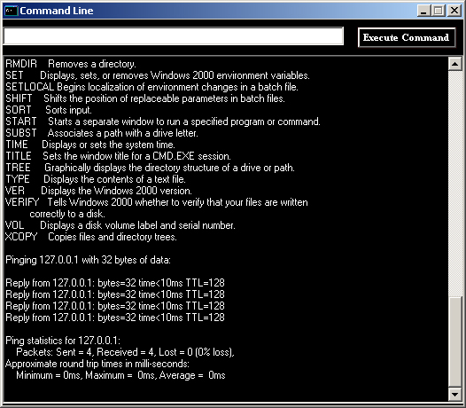



## This application allows to execute MSDOS/CMD commands\. NOT A SIMULATION, the real thing

### Description

This a demonstartion of using Command Line Prompt, or what some call console, through VB form. Uses Auto-Complete to make it easier to enter previously typed-in commans.
 
### More Info
 

             |
---                |---
**Submitted On**   |2006-09-05 00:03:26
**By**             |[Serge\_G](https://github.com/Planet-Source-Code/PSCIndex/blob/master/ByAuthor/serge-g.md)
**Level**          |Intermediate
**User Rating**    |4.3 (13 globes from 3 users)
**Compatibility**  |VB 6\.0
**Category**       |[Complete Applications](https://github.com/Planet-Source-Code/PSCIndex/blob/master/ByCategory/complete-applications__1-27.md)
**World**          |[Visual Basic](https://github.com/Planet-Source-Code/PSCIndex/blob/master/ByWorld/visual-basic.md)
**Archive File**   |[This\_appli201797952006\.zip](https://github.com/Planet-Source-Code/serge-g-this-application-allows-to-execute-msdos-cmd-commands-not-a-simulation-the-real-th__1-66467/archive/master.zip)

